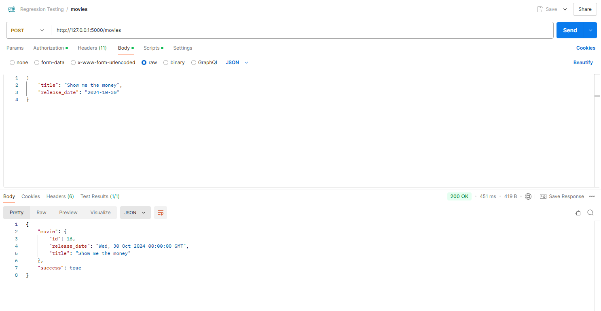

# Casting-Agency

## Project Description
This is the capstone project for Full Stack Web Developer. The Casting Agency models a company that is responsible for creating movies and managing and assigning actors to those movies. You are an Executive Producer within the company and are creating a system to simplify and streamline your process.

With front-end is very simple, most of the work are done in the back-end. I wrote Restful APIs, built a database using SQLAlchemey, secured the application using Auth0, tested the application using unit tests and via Postman, and finally deploy the application to Render.

## Tech Stack
* **PostgreSQL** as our database of choice
* **Python** and **Flask** as our server language and server framework
* **Auth0** for authentication management
* **Render** for deployment
* **HTML**, **CSS** for the simple frontend

## Getting Started

1. Initialize and activate a virtualenv:
  ```
  $ cd YOUR_PROJECT_DIRECTORY_PATH/
  $ python -m virtualenv env
  $ . env\scripts\activate (Window)
  ```
2. Install the dependencies:
  ```
  $ pip install -r requirements.txt
  ```
  This will install all of the required packages we selected within the `requirements.txt` file.

3. Database Setup

  ```
  psql casting < casting.pgsql
  ```

4. Run the development server:
  ```
  $ set FLASK_APP=app (Window)
  $ set FLASK_ENV=development # enables debug mode (Window)
  flask run
  ```

5. Auth0 Setup
- Create a new Auth0 Account
- Select a unique tenant domain
- Create a new single page web application
- Create a new API
   - in API Settings:
     - Enable RBAC
     - Enable Add Permissions in the Access Token
- Create new API permissions:
```
   `get:actors`
   `post:actors`
   `patch:actors`
   `delete:actors`
   `get:movies`
   `post:movies`
   `patch:movies`
   `delete:movies`
```
- Create new roles for:
    - Assistant
        - can `get:actors`
        - can `get:movies`
    - Director
        - All permission

## Testing
To run the tests, run 
```
dropdb casting_test
createdb casting_test
psql casting_test < casting.pgsql
python -m unittest test_app.py
```
- Result


## API Reference

### Endpoints

#### GET '/movies'
- General:
    - Return all movies in the database
    - Role Authorized: Assistant, Director
- Example:


#### GET '/actors'
- General:
    - Return all actors in the database
    - Role Authorized: Assistant, Director
- Example:


#### POST '/movies'
- General:
    - Add a new movie. The new movie must have all information. 
    - Role Authorized: Director
- Example:


#### POST '/actors'
- General:
    - Add a new actor. The new movie_id must have.
    - Role Authorized: Director
- Example:


#### PATCH '/movies/<int:id>'
- General:
    - Update some information of a movie based on a payload.
    - Roles authorized : Director.
- Example:


#### PATCH '/actors/<int:id>'
- General:
    - Update some information of an actor based on a payload.
    - Roles authorized : Director.
- Example:


#### DELETE '/movies/<int:id>'
- General:
    - Deletes a movie by id.
    - Roles authorized : Director.
- Example:


#### DELETE '/actors/<int:id>'
- General:
    - Deletes a movie by id.
    - Roles authorized : Director.
- Example:

